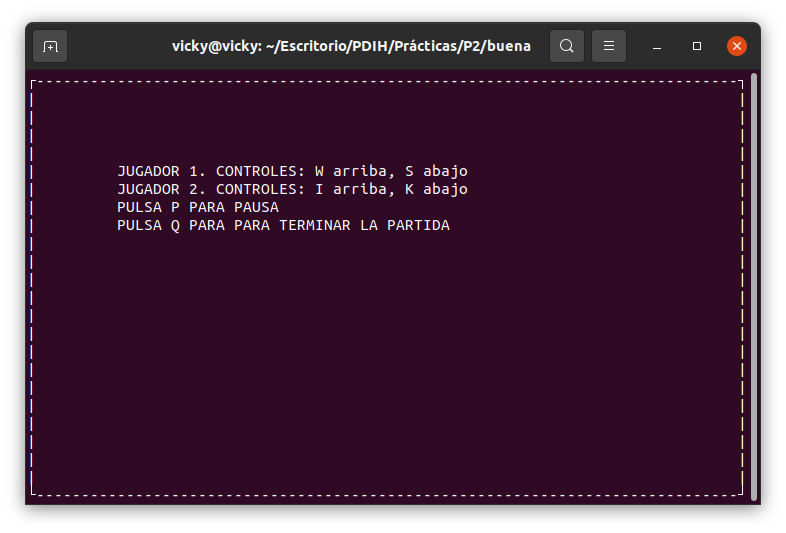
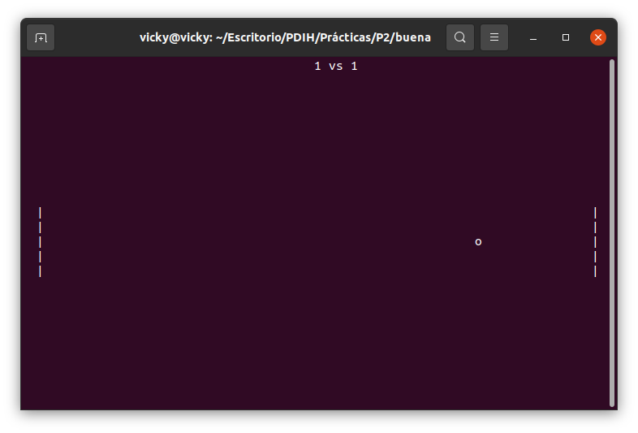
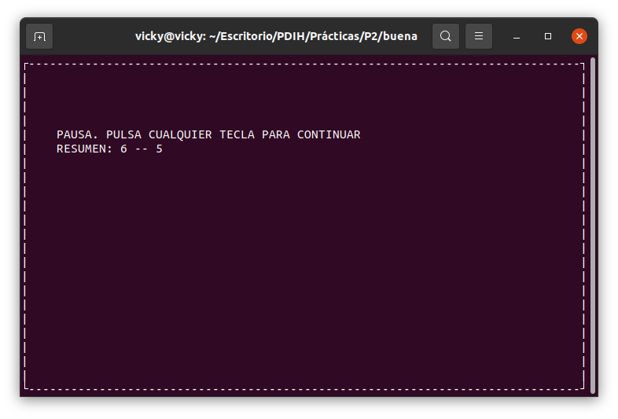
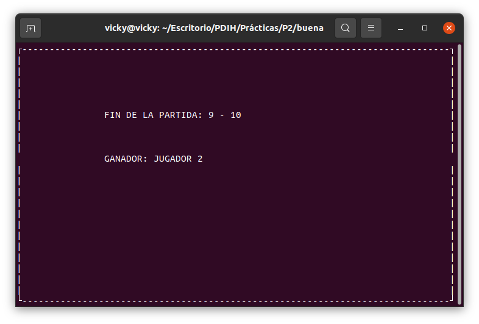
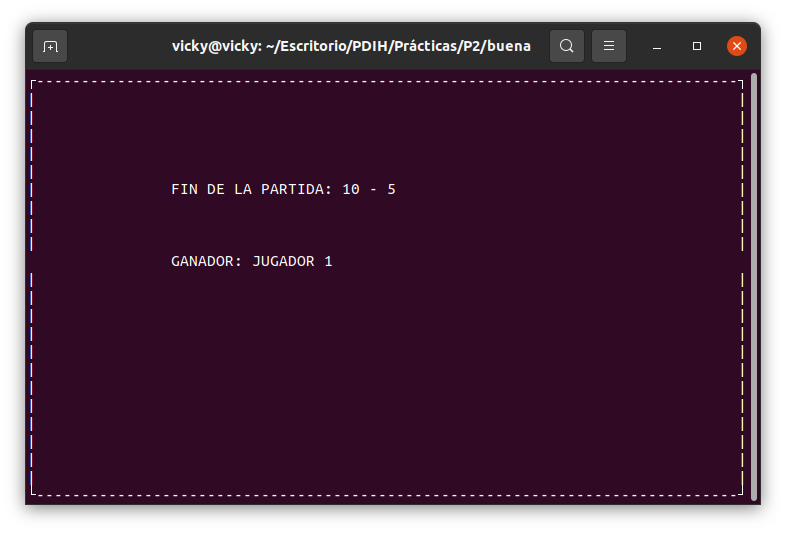
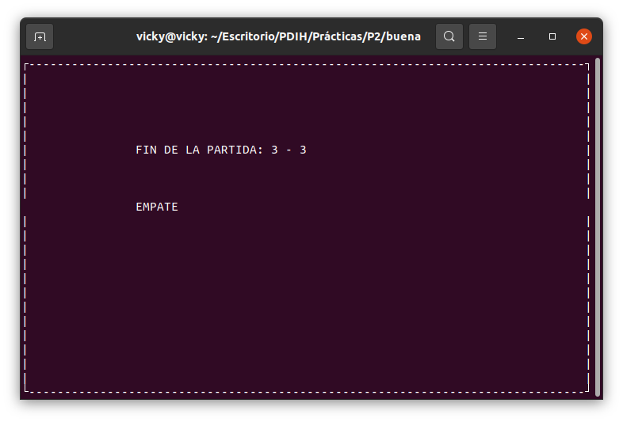

# Práctica 2. USO DE BIBLIOTECAS DE PROGRAMACIÓN DE INTERFACES DE USUARIO EN MODO TEXTO

Estudiantes:

- :bust_in_silhouette:  **Santiago Gil Legaza** :octocat: [Repositorio PDIH](https://github.com/Gogilga/PDIH)
- :bust_in_silhouette:  **Victoria Dueñas Salcedo** :octocat: [Repositorio PDIH](https://github.com/vduesal/PDIH)

## 1. Instalación librería ncurses

Para la realización de esta práctica, necesitamos tener instalada la librería ncurses en nuestra máquina. Para ello, tenemos que ejecutar en la terminal:

~~~
$ sudo apt-get install libncurses5-dev libncursesw5-dev
~~~

Además, en el código que realicemos en lenguage C tenemos que incluir al principio ``#include <ncurses.h>``.

## 2. Implementación juego Pong

A partir de los programas de ejemplo mostrados en clase sobre el funcionamiento de la librería *ncurses*, implementaremos el juego [*Pong*](pong.c). Nuestro juego mostrará por pantalla dos palas con las que los jugadores tendrán que parar la bola que está en movimiento para no chocar contra los laterales. El choque de con los laterales implicaría un punto para el jugador de la pared contraria. Ganaría el jugador que llegue antes al máximo de puntos definido. Por otro lado, también vamos a implementar una pantalla para el inicio y otra para el final de la partida, y una pantalla más para poner el juego en pausa.

### 2.1. Controles del juego
---

- w: arriba pala del jugador 1
- s: abajo pala del jugador 1
- i: arriba pala jugador 2
- k: abajo para jugador 2
- p: pausa de la partida
- q: terminar la partida

### 2.2. Funciones de la librería ncurses utilizadas
---

- ``initscr()``: determina el tipo de terminal e inicializa las estructuras de datos de ncurses.
- ``edwin()``: finaliza el modo ncurses, restaura los modos de tty a como estuvieran cuando se llamó por primera vez a initscr() y mueve el cursor abajo a la esquina izquierda.
- ``noecho()``: no hacer el eco de entrada.
- ``curs_set(FALSE)``: hace que el cursor desaparezca y luego vuelva a aparecer.
- ``mvprintw(x,y,”mensaje”)``: imprime por pantalla el mensaje en las coordenadas indicadas x,y.
- ``box(stdscr,‘|’, ‘-’)``: crea una caja por el borde de la pantalla.
- ``getch()``: espera una pulsación de una sola tecla.
- ``nodelay(stdscr,1)``: hace que getch() sea una llamada sin bloqueos; si no hay ninguna entrada lista getch() devuelve error.
- ``clear()``: borra todo o parte de una ventana ncurses.
- ``getmaxyx(stdscr,fils,cols)``: halla las dimensiones de la pantalla.
- ``refresh()``: actualiza el aspecto de la pantalla.
- ``usleep(DELAY)``: suspende un proceso por un número determinado de segundos.
- ``keypad(stdscr,true)``: activa y desactiva la función de procesado de caracteres especiales.

### 2.3. Funciones auxiliares
---

- ``void inicio()``: muestra por pantalla las instrucciones del juego, explicadas en el apartado anterior. En esta función, inicializamos ncurses, activamos la función de procesado de caracteres especiales, quitamos el eco y ocultamos el cursor. Después de mostrar las instrucciones, se limpia la pantalla.
- ``void pausa(int x1, int x2)``: pone en pausa el juego hasta que se pulsa una tecla nuevamente. Limpia la pantalla por completo y muestra el resultado de la partida hasta el momento.
- ``void fin(int x1, int x2)``: muestra la pantalla final, incluyendo el resultado final de la partida y decide quién es el jugador ganador.
- ``void palas(int columnas, int pos1, int pos2)``: mediante un bucle for, dibujamos las palas en ambos laterales de la pantalla. Estarán formadas por cinco barras verticales una encima de la otra.

### 2.4. Código
---

En la primera parte del *main* hemos declarado todas las variables necesarias para la implementación del juego. Entre ellas, encontramos las variables para pausar y quitar la partida, las filas y columnas de la pantalla, la puntuación con la que se gana la partida, y las variables para gestionar el movimiento de la bola, entre otras.

En primer lugar, llamamos a la función auxiliar ``inicio()``, para mostrar la pantalla inicial, y averiguamos las dimensiones de la pantalla.

El resto de código, excluyendo la llamada a la función ``endwin()``, se concentra dentro de un bucle *while* del que no saldremos a no ser que se presione la tecla *q*. Dentro de este bucle, empezaremos dibujando en la pantalla la bola y las palas.

Para el movimiento de las palas hemos utilizado un *switch*, en el que en función de la tecla presionada se moverá una pala u otra para la dirección correspondiente.

Para el movimiento de la bola, hay varias cosas a tener en cuenta:

- Comprobar cuando choca con las palas para que rebote y no haya recuento de puntos.
- Comprobar cuando llega a las paredes laterales, para dar los puntos al jugador correspondiente.
    - Si la bolita llega a tocar un lateral, la pelota se coloca en el centro y se le suma un punto al jugador que lo ha anotado.

Por último, dentro del bucle comprobamos si alguno de los dos jugadores ha obtenido la máxima puntuación. Si es así, se termina la partida y se muestra por pantalla el resultado y el número del jugador ganador. Si ningún jugador ha llegado a la puntuación máxima, se sigue la partida.

### 2.5. Funcionamiento del programa
---

Mostramos, por último, el funcionamiento del programa mediante capturas de pantalla realizadas en la ejecución de la partida.

Pantalla de inicio:

Pantalla de la partida:

Pantalla de pausa: 

Pantalla de fin (ganador jugador 2): 

Pantalla de fin (ganador jugador 1):

Pantalla de fin (empate): 

