# Práctica 3. EXPERIMENTACIÓN CON ARDUINO

Estudiantes:

- :bust_in_silhouette:  **Santiago Gil Legaza** :octocat: [Repositorio PDIH](https://github.com/Gogilga/PDIH)
- :bust_in_silhouette:  **Victoria Dueñas Salcedo** :octocat: [Repositorio PDIH](https://github.com/vduesal/PDIH)

## 1. Parpadeo led

Implementar el programa de parpadeo de LED, ampliándolo para que encienda y apague alternativamente tres LEDs (uno rojo, otro amarillo y otro verde), conectados a las salidas digitales 11, 12 y 13 del Arduino, a un intervalo de 1.5 segundos. Crear el esquema con Fritzing y cargar el programa en Arduino para comprobar que funciona correctamente.

Componentes eléctricos utilizados: 
- Un LED rojo
- Un LED amarillo
- Un LED verde
- Tres resistencias de 220Ω
- Una placa Arduino Uno R3

Esquema de conexiones eléctricas:

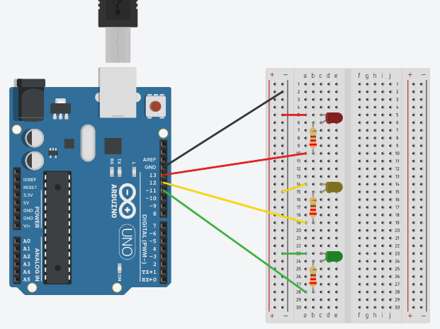

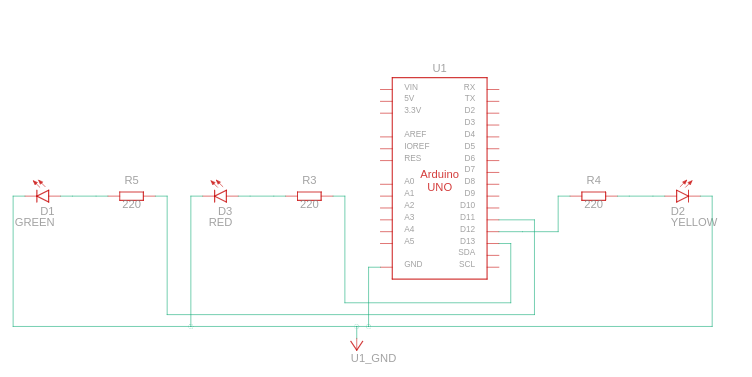

Código fuente:

```
void setup()
{
  pinMode(11, OUTPUT);
  pinMode(12, OUTPUT);
  pinMode(13, OUTPUT);
}

void loop()
{
  digitalWrite(11, HIGH);
  delay(1500); // Wait for 1500 millisecond(s)
  digitalWrite(11, LOW);
  delay(1500); // Wait for 1500 millisecond(s)
  digitalWrite(12, HIGH);
  delay(1500); // Wait for 1500 millisecond(s)
  digitalWrite(12, LOW);
  delay(1500); // Wait for 1500 millisecond(s)
  digitalWrite(13, HIGH);
  delay(1500); // Wait for 1500 millisecond(s)
  digitalWrite(13, LOW);
  delay(1500); // Wait for 1500 millisecond(s)
}
```

Los pines 11, 12 y 13 son de salida y hacen referencia a los tres LEDs verde, amarillo y rojo, respectivamente.

Imágenes demostrativas del funcionamiento: 

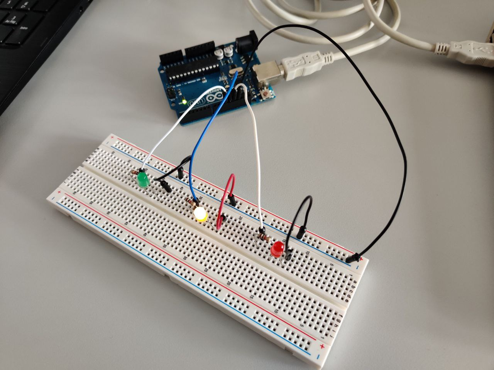


## 2. Parpadeo led con pulsador

Partir del programa de parpadeo de LEDs anterior y ampliarlo con las modificaciones necesarias para que se encienda el LED rojo solo cuando se pulse un interruptor conectado a la entrada 7, y en ese momento se apaguen los LEDs amarillo y verde.

Componentes eléctricos utilizados: 
- Un LED rojo
- Un LED amarillo
- Un LED verde
- Cuatro resistencias de 220Ω
- Una placa Arduino Uno R3
- Un pulsador

Esquema de conexiones eléctricas:

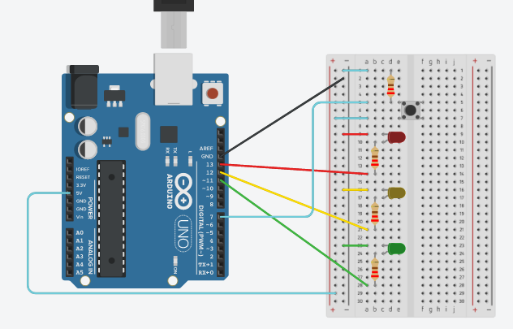

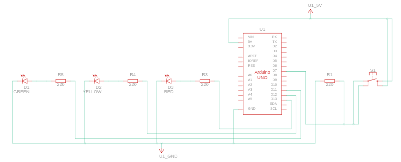

Código fuente:

```
void setup()
{
  pinMode(11, OUTPUT);
  pinMode(12, OUTPUT);
  pinMode(13, OUTPUT);
  pinMode(7, INPUT);
}

void loop()
{
  if (digitalRead(7) == HIGH){
    digitalWrite(11, LOW);
    digitalWrite(12, LOW);
    digitalWrite(13, HIGH);
  }
  else{
    digitalWrite(11, HIGH);
    digitalWrite(12, HIGH);
    digitalWrite(13, LOW);
  }
}
```

Al igual que antes, los pines 11, 12 y 13 son de salida y corresponden con los LEDs en el mismo orden que en el primer circuito. Por otro lado, en este circuito hemos añadido el pin 7, en este caso de entrada, para el pulsador que hará el cambio de bombillas encendidas.

Imágenes demostrativas del funcionamiento: 

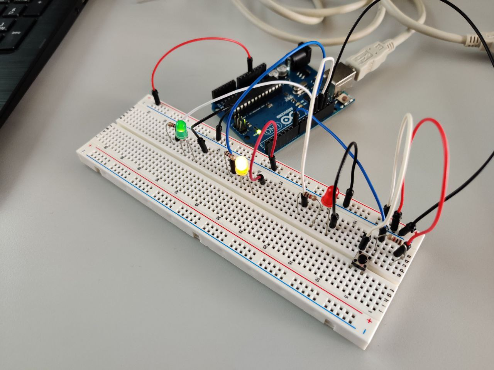

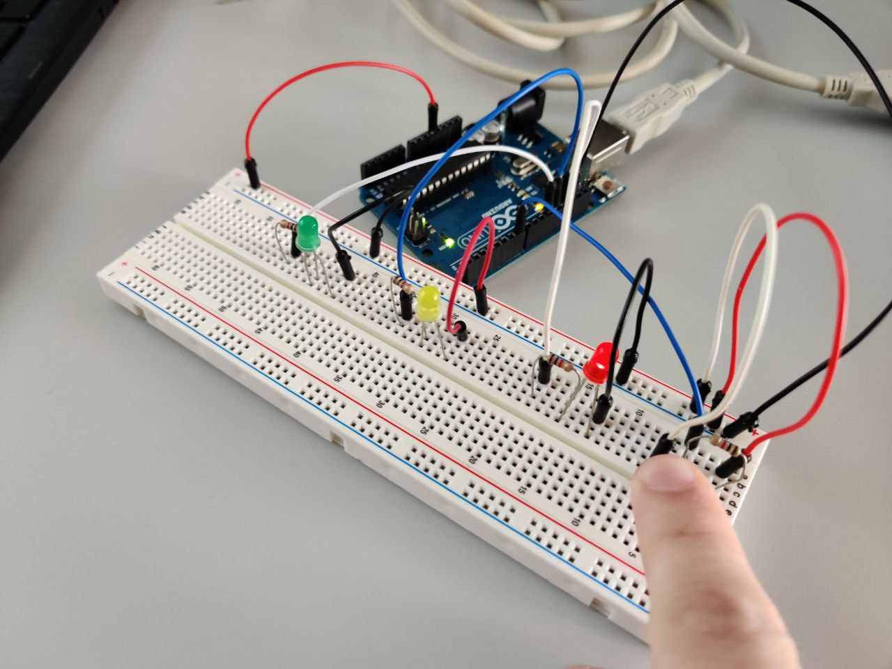


## 3. Coche fantástico

Secuencia de LEDs, encendiendo y apagando 4 LEDs secuencialmente, de forma similar a las lucecitas de “_El coche fantástico_”.

Componentes eléctricos utilizados: 
- Cuatro LEDs rojos
- Cuatro resistencias de 220Ω
- Una placa Arduino Uno R3

Esquema de conexiones eléctricas:

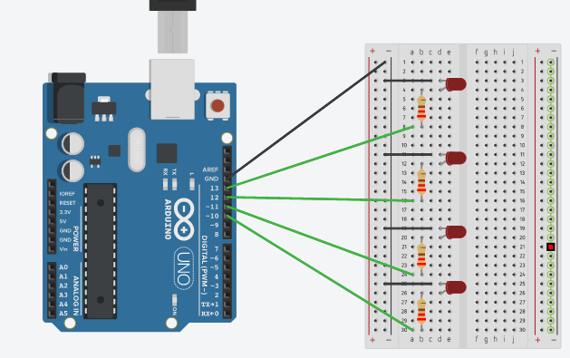

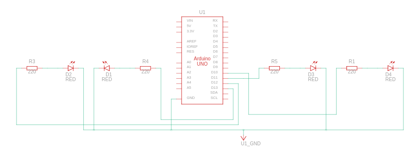

Código fuente:

```
void setup()
{
  pinMode(13, OUTPUT);
  pinMode(12, OUTPUT);
  pinMode(11, OUTPUT);
  pinMode(10, OUTPUT);
}

void loop()
{
  digitalWrite(13, HIGH);
  digitalWrite(11, LOW);
  delay(300); // Wait for 300 millisecond(s)
  
  digitalWrite(12, LOW);
  delay(300); // Wait for 300 millisecond(s)
  
  digitalWrite(12, HIGH);
  digitalWrite(10, LOW);
  delay(300); // Wait for 300 millisecond(s)
  digitalWrite(11, HIGH);
  digitalWrite(13, LOW);
  delay(300); // Wait for 300 millisecond(s)
  digitalWrite(10, HIGH);
  digitalWrite(12, LOW);
  delay(300); // Wait for 300 millisecond(s)
  
  digitalWrite(11, LOW);
  delay(300); // Wait for 300 millisecond(s)
  
  digitalWrite(11, HIGH);
  digitalWrite(13, LOW);
  delay(300); // Wait for 300 millisecond(s)
  digitalWrite(12, HIGH);
  digitalWrite(10, LOW);
  delay(300); // Wait for 300 millisecond(s)
}
```

En esta ocasión tenemos 4 LEDs rojos conectados a los pines 10, 11, 12 y 13, todos de salida.

Imágenes demostrativas del funcionamiento: 

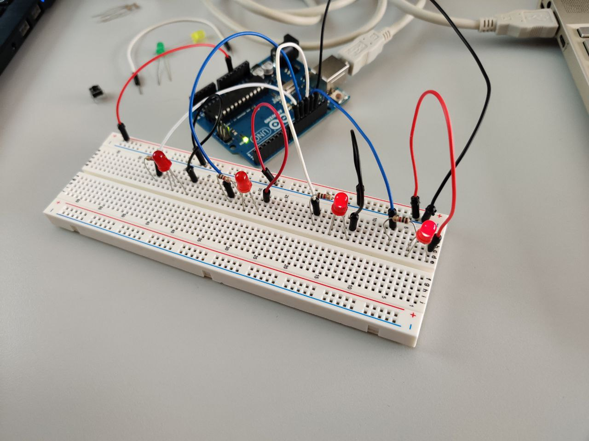


## 4. Alarma por detección de presencia.

Componentes eléctricos utilizados: 
- Un LED rojo
- Cuatro resistencias de 220Ω
- Un sensor PIR
- Un buzzer
- Una placa Arduino Uno R3

Esquema de conexiones eléctricas:

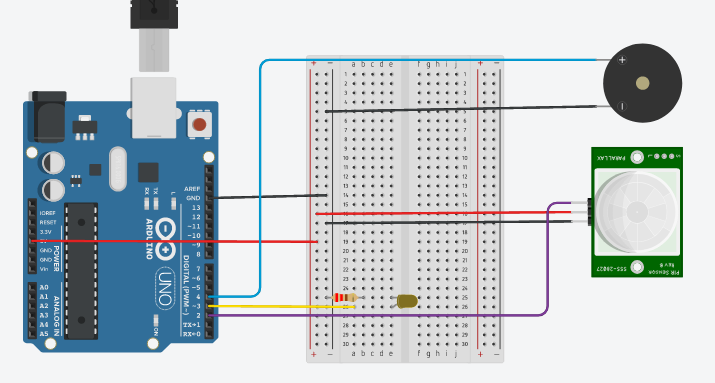

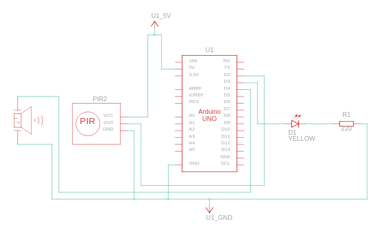

Código fuente:

```
int pir_pin = 2;
int led_pin = 3;
int val= 0;

void setup() {
  pinMode(pir_pin, INPUT);
  pinMode(led_pin, OUTPUT);
}
void loop() {
  val = digitalRead(pir_pin);
  if(val == HIGH)
  {
    digitalWrite(led_pin, HIGH);
    delay(100);
  }
  else{
    digitalWrite(led_pin, LOW);
    delay(100);
  }
}
```

Utilizamos variables globales en este último circuito para definir los pines de los componentes que tenemos. El pin 2 lo utilizamos para el sensor PIR, y será de entrada. El pin 3 corresponde con el LED, que como ya hemos dicho anteriormente es de salida. Por último, el buzzer estará en el pin 4, y también será de salida porque emitirá un zumbido cuando detecte presencia con el sensor PIR.

Imágenes demostrativas del funcionamiento: 

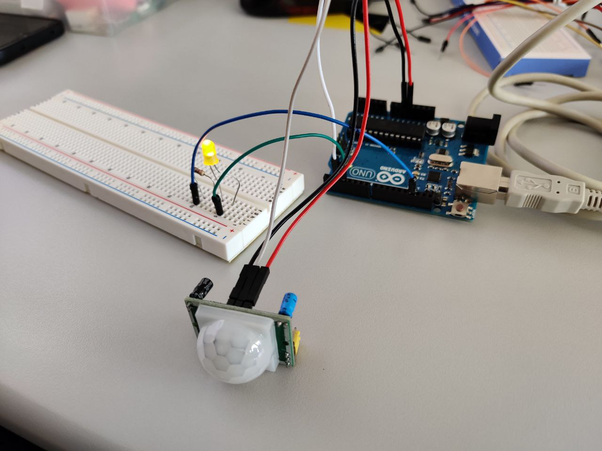

## 5. Alarma por detección de presencia  mediante sensor de distancia.

Tras varios intentos de conseguir hacer funcionar el circuito anterior con el sensor PIR y no obtener resultados satisfactorios, decidimos implementar un circuito extra con la utilización de un sensor de distancia.

Componentes eléctricos utilizados: 
- Un LED amarillo
- Un sensor de distancia
- Una placa Arduino Uno R3

Esquema de conexiones eléctricas:

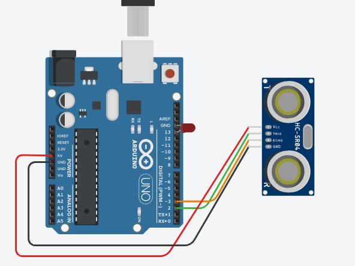

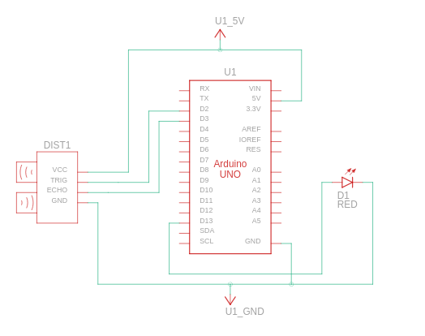

Código fuente:

```
const int Trigger = 2;   //Pin digital 2 para el Trigger del sensor
const int Echo = 3;   //Pin digital 3 para el Echo del sensor
const int led= 13;

void setup() {
  Serial.begin(9600);//iniciailzamos la comunicación
  pinMode(Trigger, OUTPUT); //pin como salida
  pinMode(Echo, INPUT);  //pin como entrada
  pinMode(led, OUTPUT);
  digitalWrite(Trigger, LOW);//Inicializamos el pin con 0
}

void loop()
{

  long t; //timepo que demora en llegar el eco
  long d; //distancia en centimetros

  digitalWrite(Trigger, HIGH);
  delayMicroseconds(10);          //Enviamos un pulso de 10us
  digitalWrite(Trigger, LOW);
  
  t = pulseIn(Echo, HIGH); //obtenemos el ancho del pulso
  d = t/59;             //escalamos el tiempo a una distancia en cm
  
  Serial.print("Distancia: ");
  Serial.print(d);      //Enviamos serialmente el valor de la distancia
  Serial.print("cm");
  Serial.println();

  if(d <= 10){
    digitalWrite(led, HIGH);
  }
  else{
    digitalWrite(led, LOW);
  }
  
  delay(100);          //Hacemos una pausa de 100ms
  
}
```

Utilizamos variables globales en este último circuito para definir los pines de los componentes que tenemos. El pin 2 lo utilizamos para el Trigger del sensor, y será de salida. El pin 3 corresponde con el Echo, que es de entrada. Por último, el LED estará en el pin 13, y también será de salida.

Imágenes demostrativas del funcionamiento: 

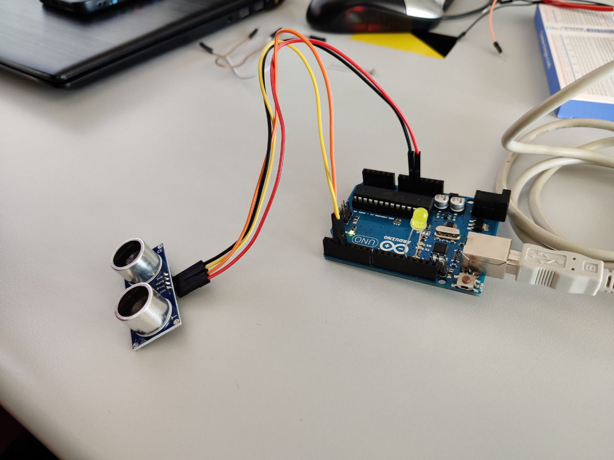

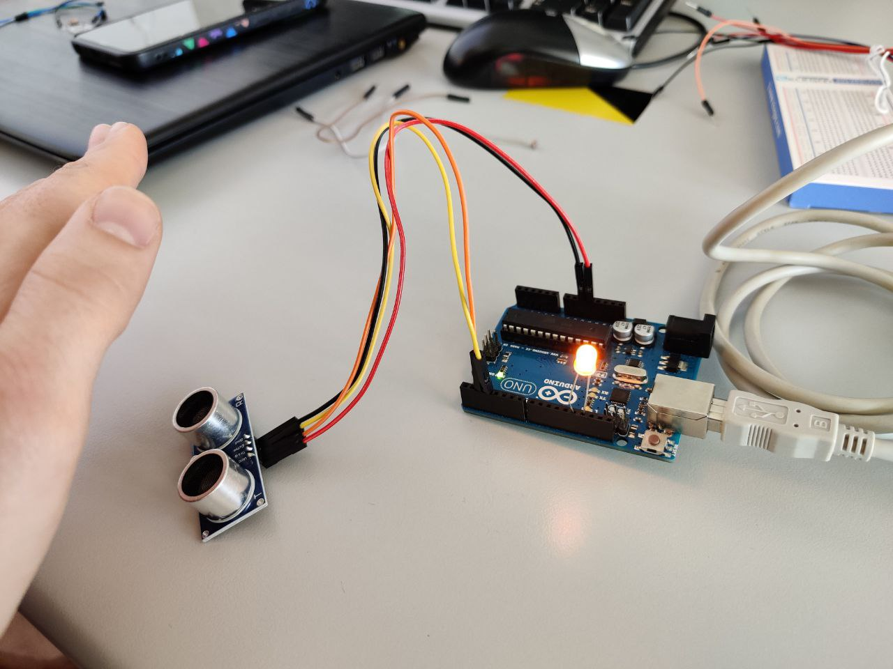

