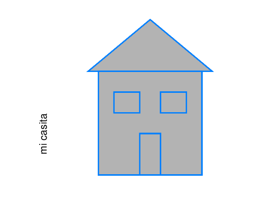
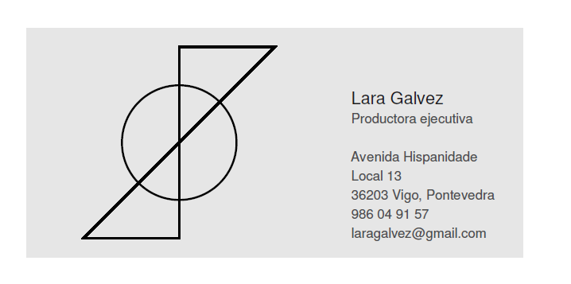
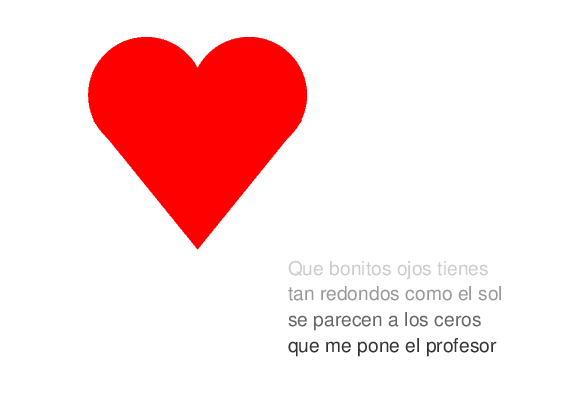

# Práctica 4. El lenguaje Postscript

Estudiantes:

- :bust_in_silhouette:  **Santiago Gil Legaza** :octocat: [Repositorio PDIH](https://github.com/Gogilga/PDIH)
- :bust_in_silhouette:  **Victoria Dueñas Salcedo** :octocat: [Repositorio PDIH](https://github.com/vduesal/PDIH)

## 1. Página en la que se muestre el dibujo de una casita

En nuestro código encontramos diferentes partes para formar poco a poco el dibujo de una casita. Entre estas partes, encontramos el tejado, la fachada, dos ventanas y una puerta.

### Código implementado

```
%!PS

% relleno de la casa
newpath
0.7 setgray             % color intermedio entre negro y blanco
200 350 moveto          % posicion inicial
300 350 lineto          % linea de (200,350) hasta (300,350)
300 450 lineto          % linea de (300,350) hasta (300,450)
200 450 lineto          % linea de (300,450) hasta (200,450)
closepath
fill
stroke

% relleno del tejado
newpath
0.7 setgray             % color intermedio entre negro y blanco
190 450 moveto          % posicion inicial
250 500 lineto          % linea de (190,450) hasta (250,500)
310 450 lineto          % linea de (250,500) hasta (310,450)
closepath
fill
stroke

% lineas del perimetro de la casa
newpath
0 0.5 1 setrgbcolor     % color RGB
200 350 moveto          % posicion inicial
300 350 lineto          % linea de (200,350) hasta (300,350)
300 450 lineto          % linea de (300,350) hasta (300,450)
200 450 lineto          % linea de (300,450) hasta (200,450)
closepath
stroke

% lineas del perimetro del tejado
newpath
0 0.5 1 setrgbcolor     % color RGB
190 450 moveto          % posicion inicial
250 500 lineto          % linea de (190,450) hasta (250,500)
310 450 lineto          % linea de (250,500) hasta (310,450)
closepath
stroke

% lineas de la puerta de la casa
newpath
240 350 moveto          % posicion inicial
240 390 lineto          % linea de (240,350) hasta (240,390)
260 390 lineto          % linea de (240,390) hasta (260,390)
260 350 lineto          % linea de (260,390) hasta (260,350)
closepath
stroke

% lineas de la ventana1 de la casa
newpath
215 410 moveto          % posicion inicial
215 430 lineto          % linea de (215,410) hasta (255,430)
240 430 lineto          % linea de (255,430) hasta (240,430)
240 410 lineto          % linea de (240,430) hasta (240,410)
closepath
stroke

% lineas de la ventana2 de la casa
newpath
260 410 moveto          % posicion inicial
260 430 lineto          % linea de (260,410) hasta (260,430)
285 430 lineto          % linea de (260,430) hasta (285,430)
285 410 lineto          % linea de (285,430) hasta (285,410)
closepath
stroke

% texto de la casa "mi casita"
/Arial findfont         % fuente del texto
10 scalefont            % tamano del texto
setfont                 % aplicar la fuente del texto
0 setgray               % color de texto: negro

newpath
150 370 moveto          % posicion inicial
90 rotate               % rotacion de 90 grados
(mi casita) show        % texto que se muestra
closepath
stroke


showpage
%%EOF
```

### Resultado 



## 2. Página en la que diseñes una tarjeta de visita

Diseñamos una tarjeta de visita guiándonos del ejemplo propuesto en clase.

### Código implementado

```
%!PS

% Rectángulo de la tarjeta
% 200 500 translate
% draw rectangles
% newpath -54 2 54 36 rectstroke
% showpage

newpath % Start a new path
0.9 setgray
150 500 moveto
260 0 rlineto
0 120 rlineto
-260 0 rlineto
closepath
fill
2 setlinewidth
stroke 

% Logo tarjeta
newpath
0 setgray % poner color de lápiz a negro
0.1 setlinewidth % poner grosor de línea (muy fina)
% x y R angI angF % dar coordenada, radio y ángulos
230 560 30 0 360 arc
1 setlinewidth
stroke

newpath % Start a new path
230 560 moveto
0 50 rlineto
50 0 rlineto
-0 0 rlineto
closepath
1 setlinewidth
stroke 

newpath % Start a new path
180 510 moveto
50 0 rlineto
0 50 rlineto
-0 0 rlineto
closepath
1 setlinewidth
stroke 

% texto 1
/Arial findfont                 % fuente del texto
9 scalefont                    % tamano del texto
setfont                         % aplicar la fuente del texto
0.1 setgray                     % color de texto: negro
newpath
320 580 moveto                  % posicion inicial
(Lara Galvez) show  % texto que se muestra
closepath
stroke

% texto 2
/Arial findfont                 % fuente del texto
7 scalefont                     % tamano del texto
setfont                         % aplicar la fuente del texto
0.3 setgray                     % color de texto: negro
newpath
320 570 moveto                  % posicion inicial
(Productora ejecutiva) show  % texto que se muestra
closepath
stroke

% Dirección Avenida Hispanidade, 13, 36203, Vigo Pontevedra, Pontevedra

% texto 3
/Arial findfont                 % fuente del texto
7 scalefont                     % tamano del texto
setfont                         % aplicar la fuente del texto
0.3 setgray                     % color de texto: negro
newpath
320 550 moveto                  % posicion inicial
(Avenida Hispanidade) show  % texto que se muestra
closepath
stroke

% texto 4
/Arial findfont                 % fuente del texto
7 scalefont                     % tamano del texto
setfont                         % aplicar la fuente del texto
0.3 setgray                     % color de texto: negro
newpath
320 540 moveto                  % posicion inicial
(Local 13) show  % texto que se muestra
closepath
stroke

% texto 5
/Arial findfont                 % fuente del texto
7 scalefont                     % tamano del texto
setfont                         % aplicar la fuente del texto
0.3 setgray                     % color de texto: negro
newpath
320 530 moveto                  % posicion inicial
(36203 Vigo, Pontevedra) show  % texto que se muestra
closepath
stroke

% texto 6
/Arial findfont                 % fuente del texto
7 scalefont                     % tamano del texto
setfont                         % aplicar la fuente del texto
0.3 setgray                     % color de texto: negro
newpath
320 520 moveto                  % posicion inicial
(986 04 91 57) show  % texto que se muestra
closepath
stroke

% texto 7
/Arial findfont                 % fuente del texto
7 scalefont                     % tamano del texto
setfont                         % aplicar la fuente del texto
0.3 setgray                     % color de texto: negro
newpath
320 510 moveto                  % posicion inicial
(laragalvez@gmail.com) show  % texto que se muestra
closepath
stroke

showpage
```

### Resultado 



## 3. Subida de nota: el dibujo de un corazón y un texto en varios tonos de gris

Para el ejercicio de subida de nota, teníamos que realizar un corazón junto a un texto en diferentes tonos grises.
Para realizar el corazón, hemos dibujado en color rojo dos círculos y un triángulo invertido. Por otro lado, cada línea del poema la hemos mostrado en una tonalidad de gris diferente, produciendo un efecto de degradado.

### Código implementado

```
%!PS

% circulo1 relleno del corazon
newpath
1 0 0 setrgbcolor
240 440 45 0 360 arc
fill
stroke

% circulo2 relleno del corazon
newpath
1 0 0 setrgbcolor
320 440 45 0 360 arc
fill
stroke

% triangulo relleno del corazon
newpath
1 0 0 setrgbcolor
199 420 moveto          % posicion inicial
280 320 lineto
361 420 lineto
closepath
fill
stroke

% texto 1
/Arial findfont                 % fuente del texto
15 scalefont                    % tamano del texto
setfont                         % aplicar la fuente del texto
0.8 setgray                     % color de texto: negro
newpath
350 300 moveto                  % posicion inicial
(Que bonitos ojos tienes) show  % texto que se muestra
closepath
stroke

% texto 2
/Arial findfont                 % fuente del texto
15 scalefont                    % tamano del texto
setfont                         % aplicar la fuente del texto
0.6 setgray                     % color de texto: negro
newpath
350 280 moveto                  % posicion inicial
(tan redondos como el sol) show  % texto que se muestra
closepath
stroke

% texto 3
/Arial findfont                 % fuente del texto
15 scalefont                    % tamano del texto
setfont                         % aplicar la fuente del texto
0.4 setgray                     % color de texto: negro
newpath
350 260 moveto                  % posicion inicial
(se parecen a los ceros) show  % texto que se muestra
closepath
stroke

% texto 4
/Arial findfont                 % fuente del texto
15 scalefont                    % tamano del texto
setfont                         % aplicar la fuente del texto
0.2 setgray                     % color de texto: negro
newpath
350 240 moveto                  % posicion inicial
(que me pone el profesor) show  % texto que se muestra
closepath
stroke

showpage
%%EOF
```

### Resultado



