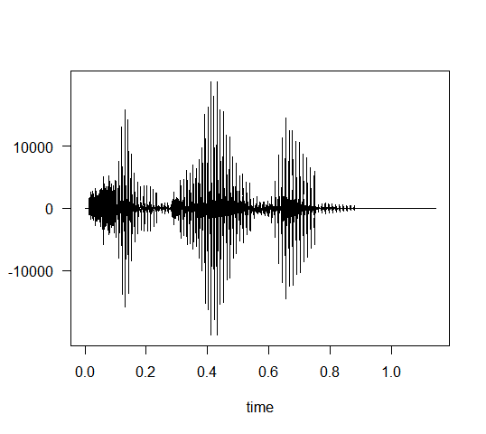
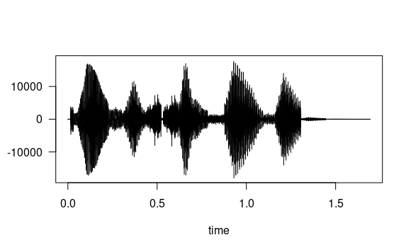

# Práctica 5. Experimentación con el sistema de salida de sonido

Estudiantes:

- :bust_in_silhouette:  **Santiago Gil Legaza** :octocat: [Repositorio PDIH](https://github.com/Gogilga/PDIH)
- :bust_in_silhouette:  **Victoria Dueñas Salcedo** :octocat: [Repositorio PDIH](https://github.com/vduesal/PDIH)

## 1. Leer dos ficheros de sonido (WAV o MP3) de unos pocos segundos de duración cada uno. En el primero debe escucharse el nombre de la persona que realiza la práctica. En el segundo debe escucharse el apellido.

### Santiago

```
nombre <- readWave('NombreSantiago.wav')
nombre
apellidos <- readWave('ApellidosSantiago.wav')
apellidos
```


### Victoria

```
nombre <- readWave('NombreVictoria.wav')
nombre
apellidos <- readWave('ApellidosVictoria.wav')
apellidos
```


## 2. Dibujar la forma de onda de ambos sonidos.

La primera onda es la del nombre, mientras que la segunda es la de los apellidos.

### Santiago




### Victoria




## 3. Obtener la información de las cabeceras de ambos sonidos.

### Santiago


### Victoria


## 4. Unir ambos sonidos en uno nuevo.

### Santiago


### Victoria


## 5. Dibujar la forma de onda de la señal resultante.

### Santiago


### Victoria


## 6. Pasarle un filtro de frecuencia para eliminar las frecuencias entre 10000Hz y 20000Hz.

### Santiago


### Victoria


## 7. Almacenar la señal obtenida como un fichero WAV denominado “mezcla.wav”.

```
# se guarda la señal en el fichero mezcla.wav
writeWave(filtrofrec, file.path("mezcla.wav"))
```

## 8. Cargar un nuevo archivo de sonido, aplicarle eco y a continuación darle la vuelta al sonido. Almacenar la señal obtenida como un fichero WAV denominado “alreves.wav”.

Para este apartado hemos escogido el fichero de audio oveja.wav.

```
# aplicar eco a un nuevo sonido y darle la vuelta
# guardar la señal en el fichero alreves.wav
nuevo <- readWave('oveja.wav')
str(nuevo)
nuevoconeco <- echo(nuevo, f=22050, amp=c(0.8,0.4,0.2), delay=c(1,2,3), output="Wave")
nuevoconeco@left <- 10000 * nuevoconeco@left
alreves <- revw(nuevoconeco, output="Wave")
writeWave(alreves, file.path("alreves.wav"))
```

## 9. Código implementado en R.

Para la implementación del código, hemos utilizado la función readWave para la lectura de los archivos de sonido. La función str nos permite visualizar la información de las cabeceras. Con la función listen podemos escuchar los archivos de sonido. Seguidamente, con la función plot podemos dibujar las ondas de sonido de los ficheros. Gracias a pastew unimos los audios deseados. Con bwfilter hemos podido aplicar un filtro de frecuencia sobre nuestra mezcla de sonidos.
Para el último apartado hemos utilizado la función echo para aplicarle eco al audio, la función revw para darle la vuelta, y la función writeWave para almacenar el sonido en un fichero de tipo Wave.

```
library(tuneR)
library(seewave)
library(soundgen)
library(audio)

# establecer el path concreto en cada caso a la carpeta de trabajo
setwd("/home/vicky/Escritorio/P5")

# cargar archivos de sonido (wav/mp3):
nombre <- readWave('NombreVictoria.wav')
nombre
apellidos <- readWave('ApellidosVictoria.wav')
apellidos

# mostrar los campos del archivo de sonido
str(nombre)
str(apellidos)

# calcular la duración exacta del sonido (con tres decimales)
round(length(nombre@left) / nombre@samp.rate, 3)
f <- nombre@samp.rate    #44100

# escuchar un sonido:
listen(nombre,f=f)

# escuchar un sonido:
listen(apellidos,f=f)

# mostrar la onda del sonido:
plot( extractWave(nombre, from = 1, to = 393984) )

# mostrar la onda del sonido:
plot( extractWave(apellidos, from = 1, to = 393984) )

# uno ambos sonidos:
mezcla <- pastew(apellidos, nombre, output="Wave")
mezcla
plot( extractWave(mezcla, from = 1, to=393984) )
listen(mezcla)

# filtro de frecuencia 
filtrofrec <- bwfilter(mezcla,f=44100, channel=1, n=1, from=10000, to=20000, bandpass=TRUE, listen = FALSE, output = "Wave")
listen(filtrofrec,f=f)
plot(extractWave(filtrofrec, from = 1, to=393984))

# se guarda la señal en el fichero mezcla.wav
writeWave(filtrofrec, file.path("mezcla.wav"))

# aplicar eco a un nuevo sonido y darle la vuelta
# guardar la señal en el fichero alreves.wav
nuevo <- readWave('oveja.wav')
str(nuevo)
nuevoconeco <- echo(nuevo, f=22050, amp=c(0.8,0.4,0.2), delay=c(1,2,3), output="Wave")
nuevoconeco@left <- 10000 * nuevoconeco@left
alreves <- revw(nuevoconeco, output="Wave")
writeWave(alreves, file.path("alreves.wav"))
```
