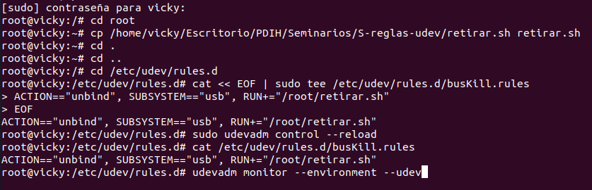
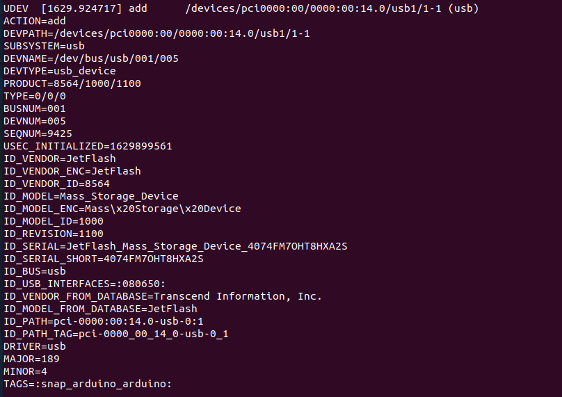
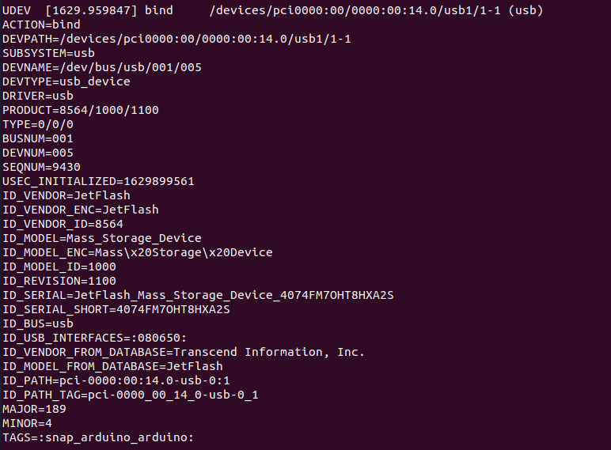
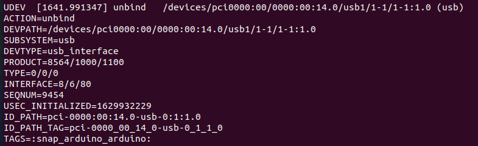
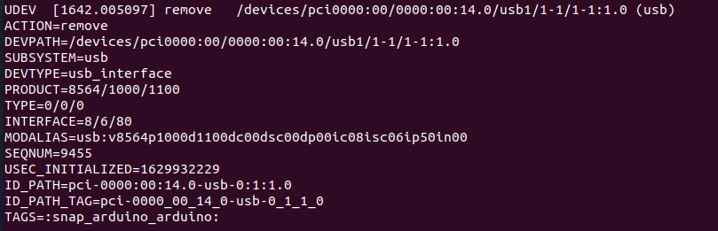

# Seminario. Gestor de dispositivos udev de Linux

Estudiante:

- :bust_in_silhouette:  **Victoria Dueñas Salcedo** :octocat: [Repositorio PDIH](https://github.com/vduesal/PDIH)

## 1. Implementación del script retirar.sh

```
#!/bin/bash
echo RETIRADO >> /root/log.txt
date >> /root/z.txt
echo " " >> /root/log.txt
```

## 2. Archivo de extensión .rules detallando el evento que queremos comprobar y la acción a realizar, y recarga de los archivos de reglas



## 3. Visualizar en tiempo real los eventos, conectando y desconectando un dispositivo USB

### Add



### Bind



### Unbind



### Remove


