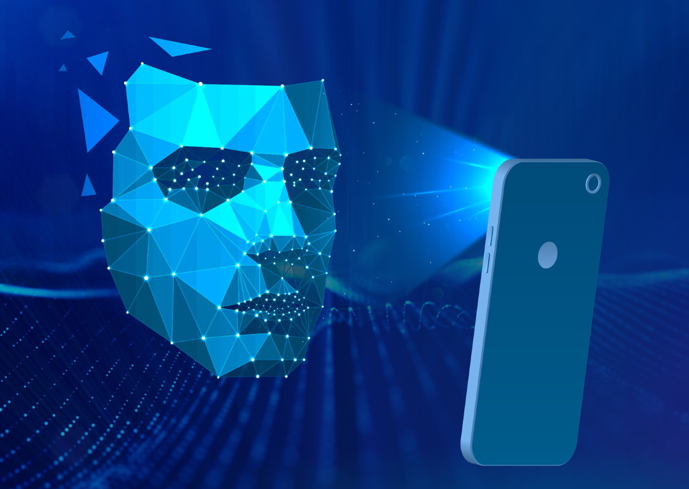
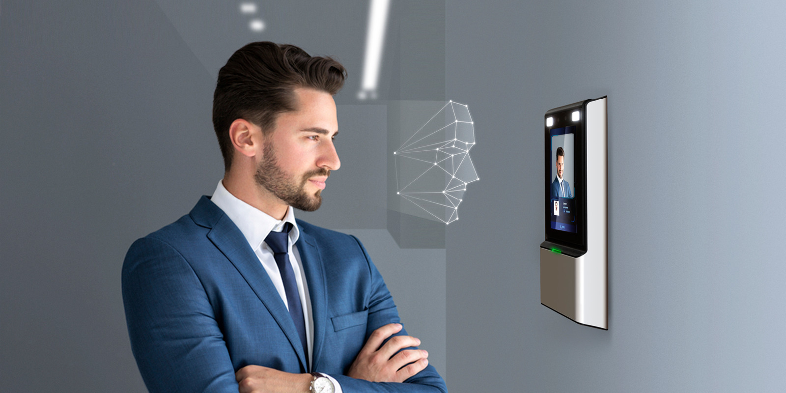
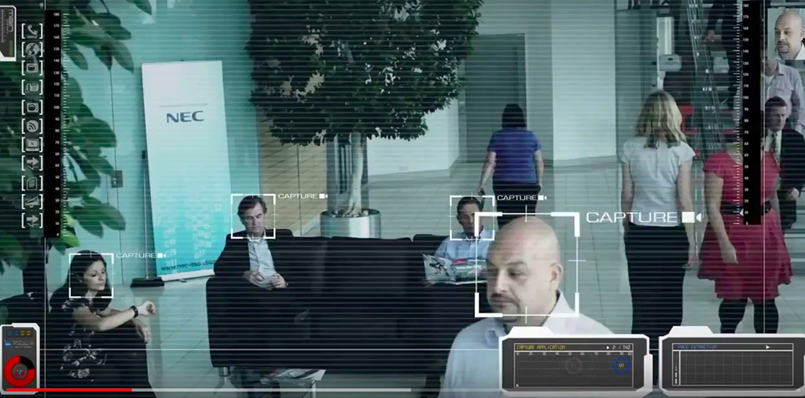
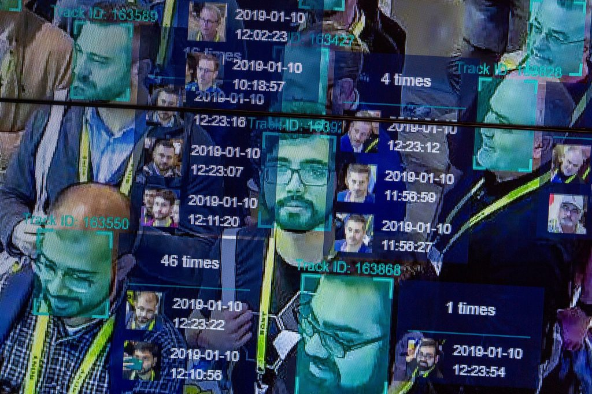
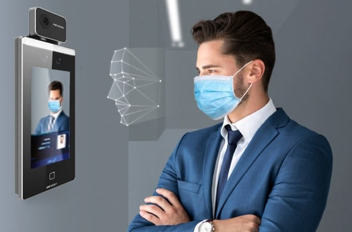
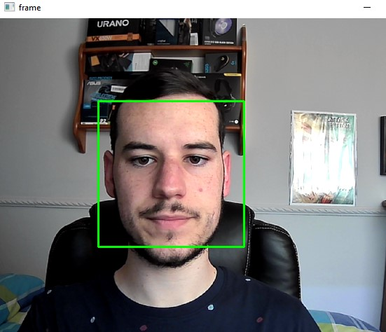
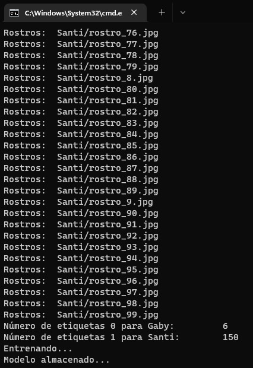
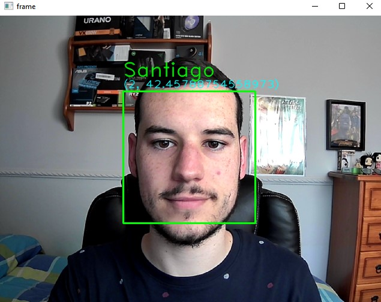

# TRABAJO FINAL: RECONOCIMIENTO FACIAL

Estudiantes:

- :bust_in_silhouette:  **Santiago Gil Legaza** :octocat: [Repositorio PDIH](https://github.com/Gogilga/PDIH)
- :bust_in_silhouette:  **Victoria Dueñas Salcedo** :octocat: [Repositorio PDIH](https://github.com/vduesal/PDIH)

## 1. Introducción al reconocimiento facial

A día de hoy, el reconocimiento facial forma parte de nuestro día a día de diferentes formas, utilizándose para actividades cotidianas como el desbloqueo de un dispositivo tecnológico. Esta tecnología es capaz de identificar y verificar la identidad de un sujeto a través de una imagen, un vídeo o de cualquier elemento audiovisual de su rostro. Se sirve de medidas corporales (cara y cabeza) para reconocer la identidad de una persona, recogiendo un conjunto de datos biométricos que son únicos y están asociados al rostro y a la expresión facial de un individuo.

El objetivo del reconocimiento de caras no es el hecho de reconocer la cara en sí, sino que el verdadero objetivo es reconocer la identidad de la cara que se está analizando. La cara es el elemento principal de reconocimiento de personas que usamos a diario por el hecho de la facilidad que nos ofrece adquirir imágenes faciales sin necesidad de esfuerzo.

Debemos admitir que no supone el mismo esfuerzo para nosotros que para una computadora el acto de reconocer caras, ya que para nosotros no supone apenas esfuerzo, mientras que para dispositivos electrónicos cualquier cambio de luz o cualquier detalle que haya cambiado lo más mínimo supondría una imagen diferente y la imposibilidad de realizar la identificación. Por ello, es más complicado poder reconocer una cara en tiempo real que en una imagen o en un vídeo.

En esta documentación, vamos a trabajar con todo esto. Dada una imagen de un rostro desconocido, se encontrará una imagen del mismo rostro en un conjunto de imágenes conocidas. Las imágenes desconocidas se podrían denominar imágenes de test, mientras que las imágenes conocidas podrían llamarse imágenes de entrenamiento.

## 2. Funcionamiento y proceso del reconocimiento facial

A partir de una imagen se van comparando los rostros con los rostros de las imágenes almacenadas en la base de datos, analizándose matemáticamente (y sin margen de error) y verificando que los parámetros biométricos se corresponden con los de algún rostro de la base de datos.

Cabe decir que todo esto es posible gracias a las tecnologías de Inteligencia Artificial y de Machine Learning, ya que aportan una gran fiabilidad al proceso.
Para llevarlo a cabo, el proceso se basa en tres sencillos pasos:

1. **Captura de la imagen de la persona que va a ser identificada**: obtendremos mejores resultados con aquellas imágenes frontales de calidad, aunque gracias a los avances de la tecnología también se obtienen resultados fiables con imágenes que no tengan tanta calidad.

2. **Detección del rostro mediante análisis de la imagen**, obteniendo un patrón biométrico facial. En este paso entra en acción la Inteligencia Artificial y el Machine Learning para hallar puntos característicos del rostro (como la distancia de los ojos, la forma de los pómulos), alcanzando resultados fiables.

3. **Comparación de la imagen**, comparando las huellas faciales de la foto tomada en el paso número 1 con las disponibles en la base de datos (que suelen ser privadas).

4. **Verificación de la identidad de la imagen**: decidir qué foto es la que coincide en mayor porcentaje con la imagen tomada en el primer paso.

## 3. Técnicas del reconocimiento facial

- **Holísticas**: se tienen en cuenta los datos que aporta la cara al completo. Para esta técnica, se añaden a la base de datos algunas imágenes que se usarán para hacer las comparaciones con las imágenes en las que se quiere identificar algún rostro. Las caras que aparecen en las imágenes de test tienen rasgos característicos que se extraen a un vector de pesos, el cual es el que comparamos con las imágenes de la base de datos.

- **Geométricas**: utilizadas para reconocimiento facial en 2D y 3D. Para el reconocimiento facial en 2D, las imágenes se representan con una estructura geométrica en la que se localizan los rasgos más característicos y donde se miden algunos parámetros. Con esto, la imagen se transforma en primitivas geométricas como líneas, curvas o puntos, creando desde ahí unas plantillas que se utilizarían para comparar las imágenes de test y de entrenamiento. Por otro lado, el reconocimiento facial en 3D capta información sobre la forma de la cara y la analiza a conciencia con los metadatos que se han extraído. Se compara la imagen del rostro “desconocido” con todos los elementos de la base de datos, quedándose con el mejor resultado de coincidencia.

- **Análisis de la textura de la piel**: se basan en la apariencia y analizan el espacio. Aunque es posible aplicarlo en imágenes de baja resolución o de mala calidad, hace falta un amplio conjunto de muestras, y la verdad que los cambios de luminosidad o de expresiones influyen mucho.

- **Basadas en vídeos**: identificará a la persona en una grabación gracias a sus datos biométricos faciales. Es una técnica muy útil en la vigilancia. Al ser una imagen en movimiento y no fija podemos ver diferentes cambios en las expresiones faciales, permitiendo analizar características y cambios temporales.

## 4. Utilización del reconocimiento facial

Actualmente, el reconocimiento facial es una tecnología con un gran potencial y muy utilizada en diferentes ámbitos. Esto se debe a que es una herramienta capaz de mejorar la calidad de vida de las personas, entre algunas cosas incrementando la seguridad. Es habitual en nuestro día a día desbloquear un dispositivo tecnológico o iniciar sesión en alguna de nuestras cuentas mediante este sistema de identificación.

Encontramos esta tecnología muy útil en el ámbito legal y de seguridad, principalmente para llevar a cabo análisis forenses, búsqueda de personas desaparecidas, seguridad aeroportuaria y reconocimiento de delincuentes, entre otras acciones.

Por otro lado, tenemos también el ámbito de la salud, en el que gracias a esta tecnología podemos rastrear el uso de medicamentos, detectar enfermedades genéticas o, incluso, para procedimientos de manejo del dolor.

Podemos realizar búsquedas de nuevos clientes, publicidad personalizada, control de accesos, etc., si nos estamos refiriendo a temas relacionados con el marketing y la banca.

### 4.1. Educación

La educación online nos permite reciclarnos continuamente mientras conciliamos nuestra vida personal y laboral. Cuando se aplica reconocimiento facial a la formación online se permite identificar fácilmente al estudiante en todo momento, pudiendo así el estudiante acceder a su plataforma educativa con una webcam y un navegador.

Es útil también a la hora de la suplantación de identidad, ya que un alumno no podría hacerse pasar por otro, haciendo trampas.

### 4.2. Pagos

Hoy en día se hace mucho uso del pago mediante el teléfono o la pulsera inteligente, en la que se tiene registrada la tarjeta bancaria. Esto se denomina NFC, que es una tecnología inalámbrica que deriva de las etiquetas RFID y que es capaz de transferir grandes cantidades de datos. Proporciona comodidad a la hora de realizar los pagos, necesitando simplemente un dispositivo electrónico y el rostro del dueño de la cuenta.

Para evitar robos o usos de terceras personas no pertenecientes de la cuenta, se configura de tal forma que necesite identificarse mediante el rostro para poder hacer uso del NFC y poder realizar el pago de forma autorizada.

### 4.3. Seguridad

La aplicación más valiosa dentro del ámbito de la seguridad es la localización de personas desaparecidas. En países que no están tan desarrollados, la localización de personas es muy complicada por el hecho de no disponer de los suficientes recursos como para llevar a cabo la investigación. Por ello, se crea una enorme base de datos a nivel nacional con fotografías de las personas desaparecidas que dispone de un software de reconocimiento facial. De esta forma, si se localiza o se detecta una persona que no esté identificada, se puede comparar con las disponibles en la base de datos para intentar reconocerla.

### 4.4. Dispositivos

Utilizamos el reconocimiento facial en dispositivos tecnológicos principalmente para desbloquearlos, entre algunas cosas, ya que también podemos hacer compras u operaciones bancarias, como ya hemos dicho apartados anteriores.

Esta iniciativa se inició con Apple cuando sacó su smartphone iPhone X, aunque ya está incorporada en diferentes marcas como Samsung.

### 4.5. Accesos

El control de accesos mediante el reconocimiento facial ha sido uno de los mayores avances para ese sector ya que, utilizando esta tecnología, las empresas son capaces de garantizar que el acceso de sus empleados se realiza de manera segura, rápida y real, sin suplantaciones de identidad.

Gracias a esta tecnología, en las empresas se puede:
Saber cuándo y quién accede.
Evitar suplantaciones de identidad de los empleados.
Controlar los accesos a las instalaciones de la empresa.
Entradas y salidas más eficientes en el trabajo, de forma más rápida y sencilla.
Asegurar que los accesos solo los hacen las personas que tienen autorización.

### 4.6. Videovigilancia

En este ámbito se encuentra la posibilidad de poder identificar a las personas de manera automática con un alto grado de fiabilidad, incrementando la seguridad gracias a la detección de personal no autorizado.

Este tipo de tecnología se suele utilizar por los cuerpos de seguridad del estado para detectar delincuentes en lugares comunes (mediante las cámaras instaladas en estos sitios), ya que disponen de una base de datos de imágenes de delincuentes para poder compararlas.

## 5. Reconocimiento facial e INTERPOL

Según la página oficial de INTERPOL, los organismos encargados de la aplicación de la ley utilizan el reconocimiento facial informatizado para identificar a personas de interés para una investigación.

El Sistema INTERPOL de Reconocimiento Facial (IFRS) es una base de datos policiales mundial única ya que en ella se almacenan las imágenes faciales enviadas por más de 179 países. Este sistema se puso en marcha a finales de 2016.

Al contrario de lo que ocurre con las huellas dactilares y el ADN, el reconocimiento facial debe tener un gran número de factores en cuenta, como el envejecimiento, la cirugía plástica  o los cosméticos, ya que el rostro es algo de fácil modificación y que se puede alterar en cualquier momento.

Dentro de INTERPOL, el funcionamiento del reconocimiento facial sería de la siguiente manera:
- Codificar la imagen facial automáticamente para compararla con los perfiles almacenados en el sistema.
- Realizar un proceso manual para verificar los resultados del sistema automatizado.
- Los funcionarios cualificados y experimentados de INTERPOL examinan minuciosamente las imágenes, fijándose hasta en el más mínimo detalle, para determinar si es un posible candidato, no lo es, o no se obtiene ningún resultado concluyente.
- Por último, se pasa la información a los países que enviaron la imagen “desconocida” y a aquellos que tengan también interés en ese perfil, todo esto de acuerdo con el Reglamento de INTERPOL sobre el Tratamiento de Datos.

El Simposio Internacional sobre Dactiloscopia y Reconocimiento Facial está organizado por INTERPOL y se celebra cada dos años. En él, especialistas de todo el mundo intercambian buenas prácticas y las últimas innovaciones, ya que en muchos países esta tecnología aún está en sus inicios y todavía se están definiendo las normas y las buenas prácticas.

Además, también organizan dos veces al año reuniones del Grupo de Trabajo de Expertos en Reconocimiento Facial, el cual es el grupo consultivo de INTERPOL sobre nuevas tecnologías, procedimientos de identificación y necesidades de formación. Este grupo también se encarga de elaborar documentos oficiales para prestar asistencia a los países miembros en ese ámbito.

## 6. Reconocimiento facial y el Covid-19

A pesar de la época de enfermedad que hemos pasado, en la que todo el mundo llevaba el rostro cubierto con una mascarilla, no ha resultado imposible el hecho de seguir utilizando el reconocimiento facial, simplemente no ha sido tan fácil como en circunstancias normales.

Descubriendo las dificultades que presentaban las mascarillas a la hora del uso del reconocimiento facial, algunas empresas han investigado la manera de que no pierda tanta eficiencia esta tecnología. Para ello, la empresa española FacePhi, líder en soluciones biométricas y tecnologías de autenticación, onboarding e identidad digital, han desarrollado un software que se centra en la zona de los ojos y no en toda la cara, comenzando su uso en entidades bancarias para la aprobación de transacciones financieras con un selfie.

## 7. Demostración
Para este trabajo hemos realizado unos pequeños programas para enseñar por encima como se usa el reconocimiento facial. Para ello hemos utilizado la librería openCV, que se puede usar tanto para C++, java y python. En nuestro caso hemos utilizado python por la simplicidad de instalar la biblioteca y ponerse a realizar programas.

El proyecto se divide en tres programas:
- ``captura.py``: Este código sirve para recoger las caras que reconoce en algún vídeo o por la webcam, y lo guarda dentro de un directorio con el nombre de la persona que hayamos introducido en el programa.

- ``entreno.py``: En este código se entrena un modelo para que pueda con posterioridad reconocer las caras de las personas cuando las vuelva a ver, para ello indexa las fotos de las personas que tenemos almacenadas asignándole un número. Posteriormente se hace uso de una función llamada  LBPHFaceRecognizer_create() que usa un algoritmo llamado LBPH(Local Binary Patterns Histograms). Se usa la  función Train() para el entrenamiento, y posteriormente se guarda el modelo en un archivo xml.

- ``reconocimientoFacial.py``: Por último, haciendo uso del archivo xml creado anteriormente, el programa capta por vídeo o por webcam el rostro de las personas, y si coinciden con alguna que conoce, le coloca el nombre y queda como resultado que ha reconocido a la persona.

## 8. Referencias bibliográficas
- https://www.electronicid.eu/es/blog/post/como-funciona-reconocimiento-facial/es
- https://www.lisainstitute.com/blogs/blog/reconocimiento-facial-como-funciona-quien-utiliza
- https://www.iebschool.com/blog/reconocimiento-facial-tecnologia/#donde_facial
- https://www.interpol.int/es/Como-trabajamos/Policia-cientifica/Reconocimiento-facial
- https://facephi.com/
- https://omes-va.com/reconocimiento-facial-python-opencv/
